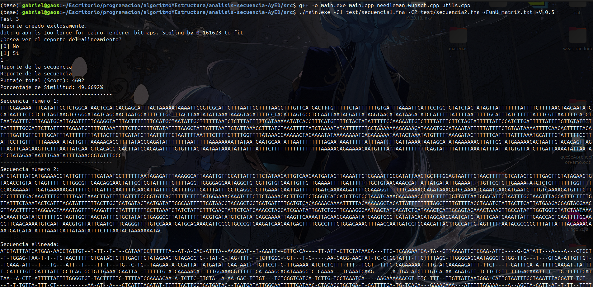

# Código
El código funciona con el uso de compilación de múltiples archivos ya que se ha dividido en distintos archivos partes del código
## Main.cpp
Main.cpp es el archivo principal que dirige a los otros dos, también es aquel que muestra los datos en general del reporte además del texto
## Utils.cpp
En utils.cpp se colocan utilidades varias por eso el nombre, donde está el leer archivos, el escribirlos.
## Needleman_wunsch.cpp
Trata del principal donde se trabaja con las secuencias además de la función para graphviz (que no está tan bien en secuencias largas)
## Acerca de los archivos .H
Son los archivos cabecera (head) donde se colocan las funciones como se llaman para poder usar modulos (es decir, otros archivos para que sea más escalable y más fácil de trabajar).
## Vista general del proyecto
>[!TIP]
> Usando tree en terminal por linux será visible las carpetas y archivos

>└── src
    ├── alignment.dot
    ├── alignment.png
    ├── imgs
    │   └── example.png
    ├── main.cpp
    ├── main.exe
    ├── matriz.txt
    ├── needleman_wunsch.cpp
    ├── needleman_wunsch.h
    ├── prueba1.fna
    ├── prueba2.fna
    ├── README.md
    ├── temp
    │   └── report.txt
    ├── test
    │   ├── secuencia1.fna
    │   ├── secuencia1.needle
    │   ├── secuencia2.fna
    │   ├── seq1.fna
    │   └── seq2.fna
    ├── utils.cpp
    └── utils.h

Explicación de los demás archivos
* Alignment.dot es el archivo de graphviz.
* Alignment.png es el archivo de texto.
* imgs es para imagenes en este README.
* matriz.txt es la matriz que se escogió para evaluar.
* prueba1 y 2 .fna son para probar en secuencias cortas.
* temp es para el reporte que es temporal.
* test secuencia1 y 2.fna son secuencias más grandes que se pueden ver.
* seq1 y seq2 fna son más grandes (genomas de bacterias completos) para ver el límite.

# Ejemplo
Un ejemplo de uso de las secuencias es el siguiente:
Compilado:
> [!IMPORTANT]
> Se debe de compilar todos los archivos a la vez para que funcione adecuadamente:
> g++ -o main.exe main.cpp needleman_wunsch.cpp utils.cpp

Ejecutando
> [!TIP]
> Ejemplo de ejecución (Se recomienda una penalidad de 0.5 para que tenga valores similares al de EMBOSS):
> ./main.exe -C1 test/secuencia1.fna -C2 test/secuencia2.fna -FunU matriz.txt -V 0.5

